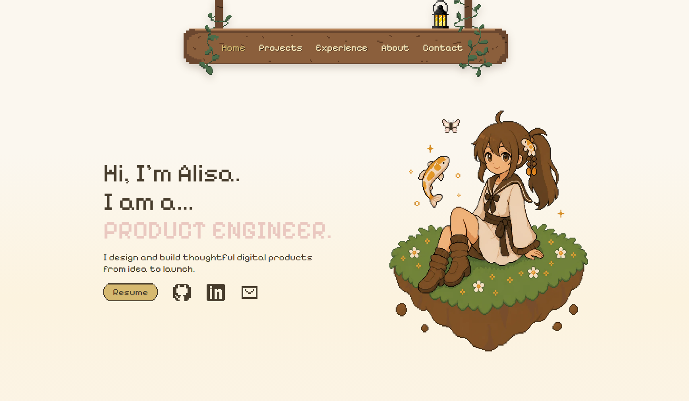

# Alisa Katsionova Portfolio



Hey, this is my personal portfolio site: [alisakat.dev](https://alisakat.dev).

I built it to show the mix of things I like working on: product engineering, UI/UX, frontend development, game projects, and tiny pixel-art details that make the site feel more like me. It has sections for featured projects, experience, a little about me, and ways to get in touch.

## What I Built

The site is a custom React portfolio with a cozy pixel-art direction. The homepage introduces me, then moves into an interactive projects section where each project can open into a case-study style modal with screenshots, links, and notes about the work.

Some of the projects featured here include:

- MyLoops, a safety-focused mobile product
- Celo, a product/web experience
- Sealbound, a Godot game demo
- Sunny Days, a Unity game project
- Infolio, a contact manager web app

## How It Is Put Together

This is a Vite + React + TypeScript project. Most of the content lives in `src/data`, so project details and case studies are separate from the components that render them. The UI is built with regular React components and a custom stylesheet in `src/styles.css`, with pixel-art assets living in `public/assets`.

The design is intentionally handmade: custom navigation art, floating islands, animated butterflies, project modals, responsive layouts, and a subtle animated background treatment.

## Running It Locally

```bash
pnpm install
pnpm dev
```

For a production build:

```bash
pnpm build
```
